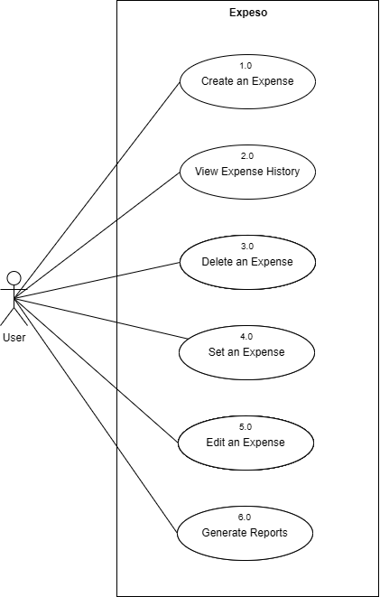

[English](/README.md) | [Tagalog](/README-FIL.md)

# Expeso (Website Documentation)

## Overview

<p align="center">
  
</p>

The diagram illustrates the use cases for the Expeso WebApp, highlighting the various interactions available to users. A key feature is the dashboard, which offers a comprehensive analysis of expenses and budgeting data. This dashboard showcases key financial metrics, providing insights to help users monitor their spending patterns and overall financial health.

Users can also manage expenses by creating, editing, or deleting entries, and they can view their expense history in detail. The system allows for setting a budget to track spending limits, and users can generate financial reports for further analysis. Additionally, users have the option to export data for external use or further auditing.

## Table of Contents

- [Expeso (Website Documentation)](#expeso-website-documentation)
  - [Overview](#overview)
  - [Table of Contents](#table-of-contents)
  - [Installation](#installation)
    - [Prerequisites](#prerequisites)
    - [Backend Setup (Laravel)](#backend-setup-laravel)
    - [Frontend Setup (React.js)](#frontend-setup-reactjs)
  - [Usage](#usage)
    - [Starting the Development Server](#starting-the-development-server)
    - [Building for Production](#building-for-production)

## Installation

### Prerequisites

Before you begin, ensure you have the following installed on your machine:

-   PHP >= 7.4
-   Composer
-   Node.js >= 12.x
-   npm or Yarn
-   MySQL or any other preferred database

### Backend Setup (Laravel)

1. **Be in the Folder**

    ```sh
    cd Expeso
    ```

2. **Install PHP dependencies:**

    ```sh
    composer install
    ```

3. **Create a `.env` file:**

    ```sh
    cp .env.example .env
    ```

4. **Generate an application key:**

    ```sh
    php artisan key:generate
    ```

5. **Configure the `.env` file:**

    - Set your database credentials.
    - Set other environment variables as needed.

6. **Run the migrations:**
    ```sh
    php artisan migrate
    ```

### Frontend Setup (React.js)

1. **Go to the frontend directory:**

    ```sh
    cd frontend
    ```

    so, you are now in `Expeso\frontend`

2. **Install JavaScript dependencies:**
    ```sh
    npm install
    # or
    yarn install
    ```

## Usage

### Starting the Development Server

To start the Laravel development server and the Vue.js development server:

1. **Start the Laravel server:**

    Go back to [Backend](/) and run

    ```sh
    php artisan serve
    ```

2. **Start the React.js development server:**
    ```sh
    npm run dev
    # or
    yarn dev
    ```

### Building for Production

To run the assets for frontend production:

1. **Locate frontend directory [\frontend](\frontend)**

2. **Build React.js assets:**
    ```sh
    npm run production
    # or
    yarn production
    ```
